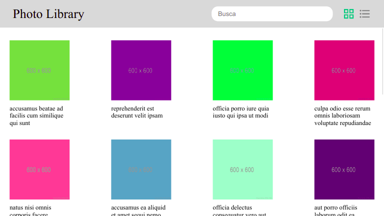
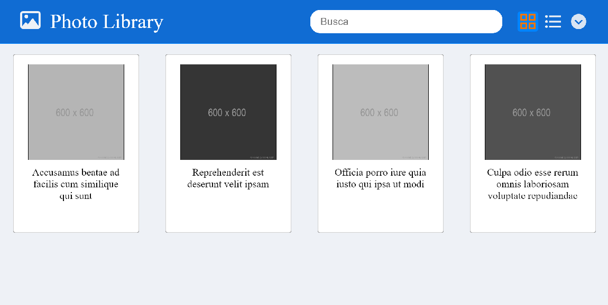

# Teste desenvolvedor front-end DIGA #

### Introdução ###

O projeto consiste de uma biblioteca de fotos, com uma única página para a exibição dos dados.

A partir do código existente, o candidato deverá implementar as funcionalidades propostas e gerar o pacote de distribuição do projeto, abrindo um pull request no repositório de código contendo os arquivos fonte e o pacote de distribuição.

### Implementações ###

Com base no sugerido, foi realizado as alterações listadas abaixo:

    1. Botão para carregamento de mais imagens (opção para escolher quantas imagens carregar por vez via prompt)
    2. Busca com atualização automática enquanto escreve.
    3. Modo de visualização em lista com thumbnails.
    4. Responsividade para dispositivos com telas menores de 600 pixels de largura.
    5. Possibilidade expandir a imagem clicando (tanto card quanto em lista).
    6. Alterações estéticas (Alteração de cores, Hover de ativação dos cards/lista, efeitos nos botões tanto de estilo quanto de)

