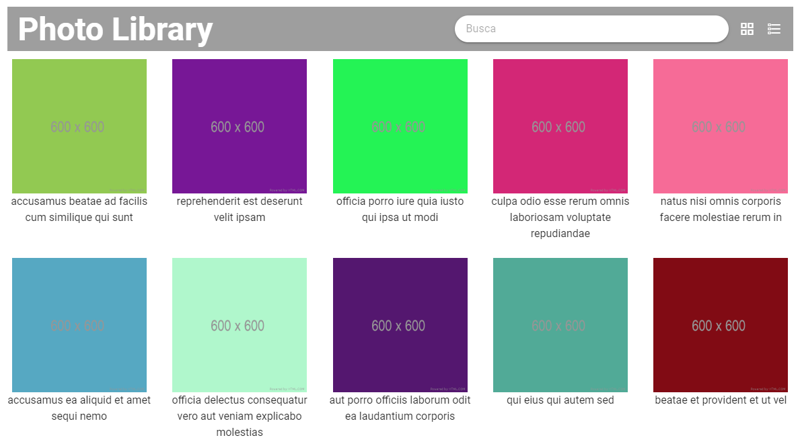

# Teste desenvolvedor front-end DIGA #

### Introdução ###


(resolução: 1920x1080px)

O projeto consiste de uma biblioteca de fotos, com uma única página para a exibição dos dados.

A partir do código existente, o candidato deverá implementar as funcionalidades propostas e gerar o pacote de distribuição do projeto, abrindo um pull request no repositório de código contendo os arquivos fonte e o pacote de distribuição.

### Estrutura: ###

O projeto foi desenvolvido com HTML, CSS e JavaScript.

Gerenciador de pacotes: [NPM](https://docs.npmjs.com/)

Empacotador (para distribuição): [Webpack](https://webpack.js.org/concepts/)

### API: ###

Os dados são fornecidos pela API de fotos do [JSON Placeholder](https://jsonplaceholder.typicode.com/).

Formato do retorno:

```
"albumId": 1,
"id": 1,
"title": "accusamus beatae ad facilis cum similique qui sunt",
"url": "https://via.placeholder.com/600/92c952",
"thumbnailUrl": "https://via.placeholder.com/150/92c952"
```

### Instruções: ###

1) Faça um fork do repositório;

2) Clone o repositório para a sua máquina local;

3) Instale o NPM (caso ainda não tiver);

4) Rode `npm install` pelo prompt de comando na pasta do projeto;

5) Abra um pull request para entregar o teste.

### O que deve ser feito: ###

**1) Use a criatividade para carregar mais fotos:**

Atualmente são exibidas apenas 20 das 500 retornadas pela API.

**2) Implemente a busca:**

Ao digitar no campo de busca, as fotos devem ser filtradas de acordo com seu título.

**3) Desenvolva a visualização por lista:**

A página deve possibilitar a exibição por lista, onde as fotos serão dispostas uma em baixo da outra. O tipo de visualização é definido nos ícones ao lado do campo de busca.

Na visualização por lista, o thumbnail da imagem deve ser exibido ao invés da imagem original e ID de cada foto também deve ser apresentado.


### O que pode ser feito: ###

**1) Responsividade:**

A página foi desenvolvida para a resolução de 1920x1080px, nos mostre que ela pode ficar apresentável em outras resoluções também.

**2) Acabamento:**

Quaisquer melhorias funcionais e visuais que melhorem a experiência do usuário dentro da página são bem-vindas.

### O que vamos avaliar: ###

1) Correta implementação das funcionalidades;

2) Legibilidade do código;

3) Histórico de commits.